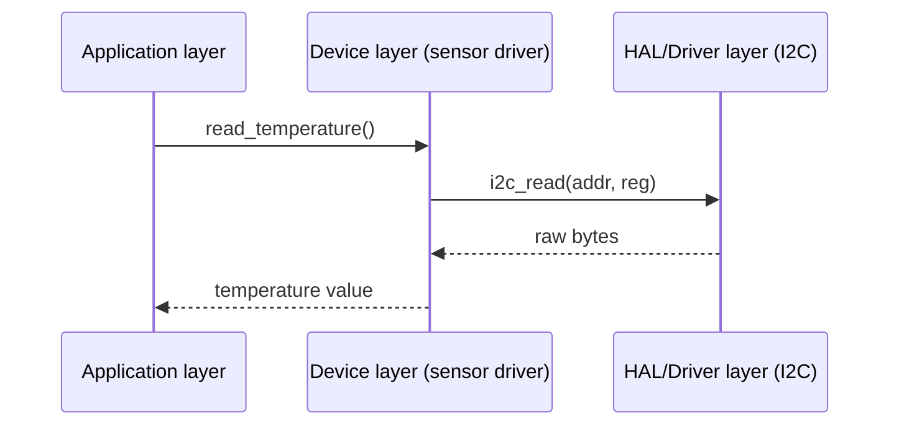

## Scenarios (+1 view)

The use case that exercises all four views below: the application layer
periodically reads a sensor value over I2C and reports it.

```mermaid
sequenceDiagram
    participant App as Application layer
    participant Dev as Device layer (sensor driver)
    participant HAL as HAL/Driver layer (I2C)

    App->>Dev: read_temperature()
    Dev->>HAL: i2c_read(addr, reg)
    HAL-->>Dev: raw bytes
    Dev-->>App: temperature value
```
