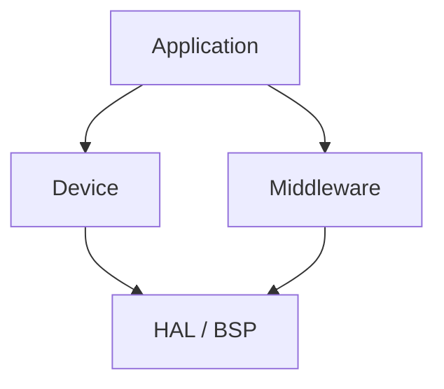

## Logical View

Functional decomposition into layers, matching the `application` / `device` /
`middleware` / `hal_bsp` folders in `example_sources/`. Dependencies only point
downward.

- **Application** — domain logic (e.g. reporting, control loops)
- **Device** — device-specific abstraction (e.g. this sensor's register map)
- **Middleware** — reusable protocol/service code shared across devices
- **HAL/BSP** — microcontroller and board-specific hardware access
