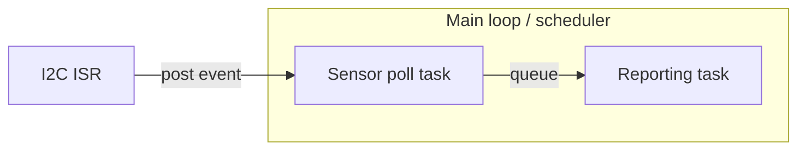

## Process View

Runtime concurrency and communication between concurrently executing units.

- <Which parts run as RTOS tasks vs. bare main-loop vs. interrupt context>
- <Inter-task communication mechanism: queues, events, shared state + locking>
- <Any hard timing constraints (e.g. ISR must not block)>
