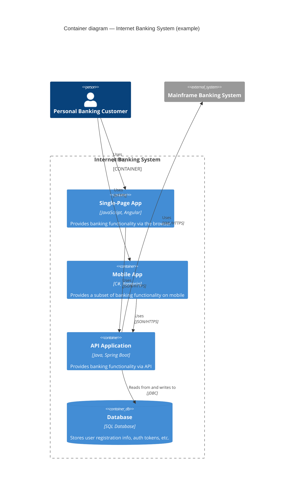
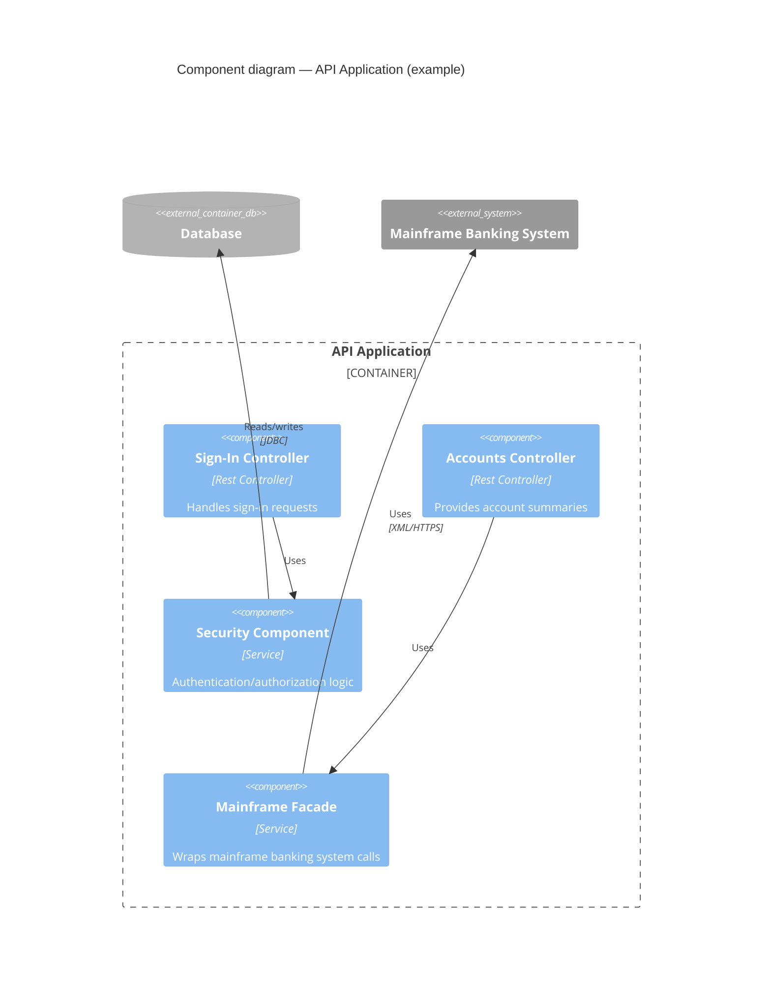

## 5. Building Block View

### 5.1 Whitebox Overall System

**Contained building blocks**

| Block | Responsibility |
| ----- | --------------- |
| Single-Page App | \<...\> |
| Mobile App      | \<...\> |
| API Application | \<...\> |
| Database        | \<...\> |

#### 5.1.1 \<Name black box 1\>

\<Purpose/Responsibility · Interface(s) · Quality characteristics · File location · Open issues\>

### 5.2 Level 2 — \<API Application\>

### 5.3 Level 3

\<Whitebox description of an individual component from Level 2, if it needs
further decomposition\>
