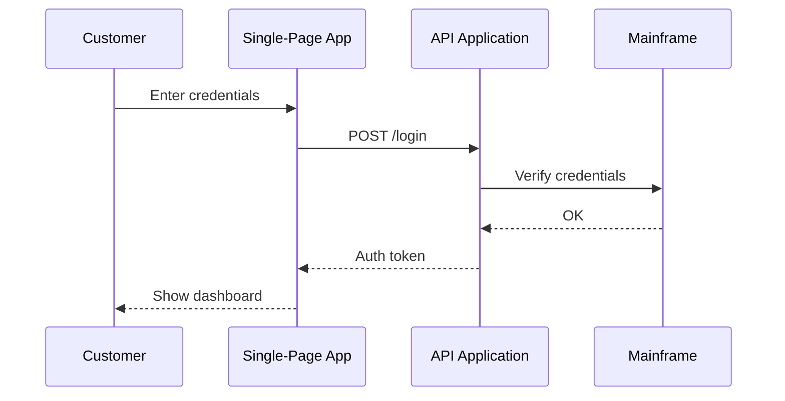

## 6. Runtime View

### 6.1 Sign-In (example scenario)

```mermaid
sequenceDiagram
    participant Customer
    participant SPA as Single-Page App
    participant API as API Application
    participant Mainframe

    Customer->>SPA: Enter credentials
    SPA->>API: POST /login
    API->>Mainframe: Verify credentials
    Mainframe-->>API: OK
    API-->>SPA: Auth token
    SPA-->>Customer: Show dashboard
```

\<Notable aspects of the interaction shown above\>

### 6.2 \<Runtime Scenario n\>
