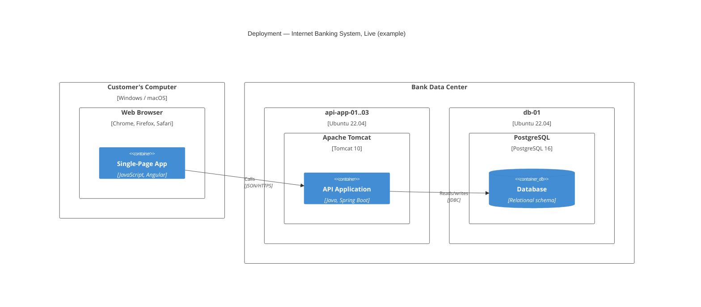

## 7. Deployment View

### 7.1 Infrastructure Level 1

**Mapping of building blocks to infrastructure**

\<Which container runs on which node, scaling/redundancy notes\>

### 7.2 Infrastructure Level 2

\<Detail for an individual infrastructure element, if needed\>
