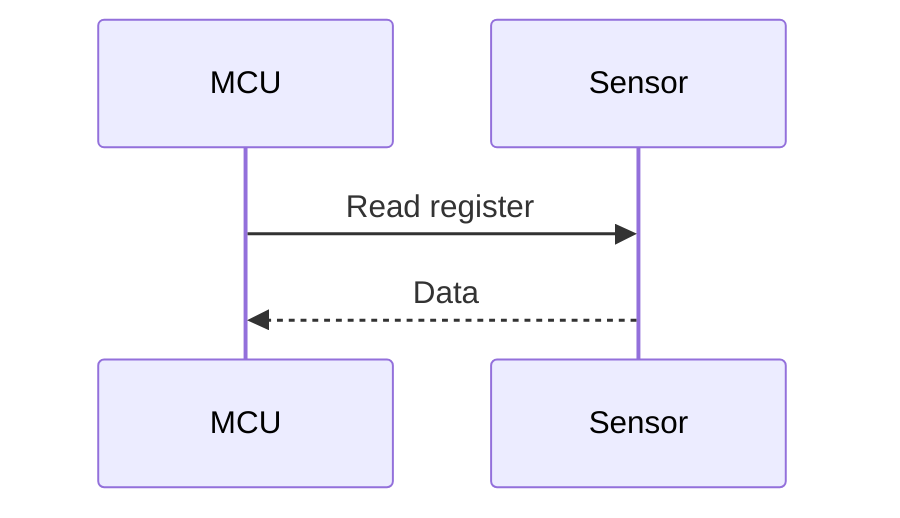

# Unit Documentation

This folder holds the design documentation for this unit, kept alongside its source
(`inc/`, `src/`) instead of in a separate central document.

## Public Interface

The functions declared in [`example_unit.h`](../inc/example_unit.h): parameters,
return/error codes, and any pre/post-conditions callers must respect.

### I2C sensor read sequence

Example only — shows how to embed a Mermaid `sequenceDiagram` (requires a
Mermaid-aware Markdown preview, e.g. "Markdown Preview Mermaid Support").

## Internal Data

The private state this unit owns and does not expose via its interface: context
struct, static variables, buffers.

### Register map (packet composition)

Example only — shows how to embed a Mermaid `packet-beta` bit-field diagram.

## Design Decisions

Key design choices and why they were made — alternatives considered, trade-offs,
constraints that drove the decision (e.g. polling vs. interrupt-driven, buffer
sizing, chosen data representation). Keep entries dated/short, like a changelog of
decisions rather than a narrative.

Replace these placeholders with real content as the design is defined. The
project-level SDD should link to this folder rather than duplicate its content.
